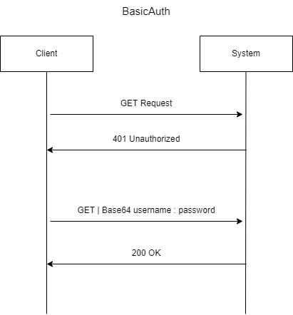
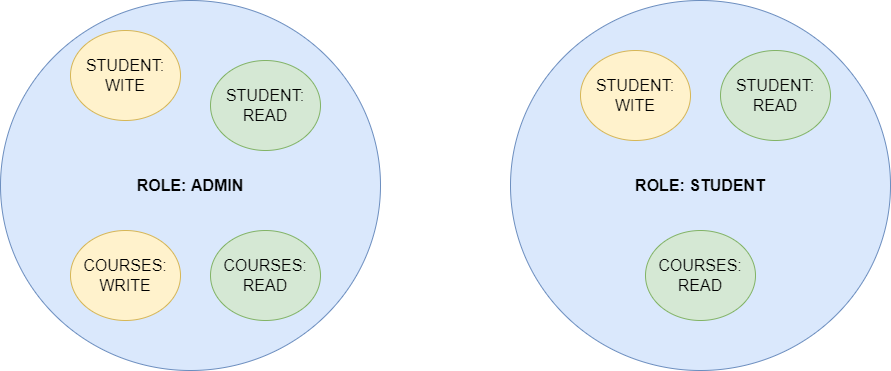

## Overview
The application is designed to demonstrate the most common use of **Spring Security** using the **BasicAuth** pattern to allow authentication to different users in the system. Checkout the `ApplicationSecurityConfig` class to better understand the behaviour of BasicAuth pattern.

### BasicAuth
The BasicAuth is the most common approach to easily introduce authentication into your system by securing your endpoints (except those who you whitelist explicitly using `.antMatchers()` and `.permitAll()`). It works by sending _username_ and _password_ in request headers using **Base64** which then server reads to match with stored username and password.

#### How it works?

#### Implementation
For implementing HTTP BasicAuth in your Spring applications, you need to override `configure(HTTPSecurity http)` method by setting `http.` to `.httpBasic()` and implement the below methods to use HTTP BasicAuth to secure your REST endpoints. Checkout `ApplicationSecurityConfig` class under `security` package to understand more about the implementation. 

* #### `InMemoryUserDetailsManager`
The application currently uses this method to store multiple `UserDetails` objects and stores it in-memory. This means that when the system starts it is stored **in-memory** i.e. no persistence maintained over entire life-time.

* #### `BCryptPasswordEncoder`
The application uses this method to encode plain raw password and then store the `UserDetails` in-memory as forced by Spring Security. Checkout `PasswordConfig` class to understand the usage. The `PasswordEncoder` is injected into `ApplicationSecurityConfig` class via constructor-based approach annotated with `@Autowired`. The `UserDetails.builder().password()` is passed `passwordEncoder.encode(_your-password_)` which encrypts the password and then stores it in-memory.

### Roles & Permissions
The project uses Java `enum` (check under `security` package) to define roles and permissions in the system. The system contains two roles:
* `ADMIN`: Full-access over the system. Includes all READ, WRITE exclusive permissions.
* `STUDENT`: Limited access. Can READ information but limited to WRITE.

The diagram below represents the encapsulated version.

### Authentication
The application supports two forms of authentications:

* #### ROLE based authentication
The role based authentication works on reading specified `.role(_ROLE_)` of each `UserDetails` object in-memory. We specified each endpoint using `.antMatchers(_ENDPOINT_)` and `.hasRoles(_ROLE_)` so it blocks and forwards only those User requests which has the matching specified role. Checkout `ApplicationUserRoles` and `ApplicationUserPermissions` enums to understand more about the implementation.

* #### PERMISSION based authentication
The permission based authentication works on checking each incoming requests type and granting access on basis of specified permissions on type of request method. We have specified each `StudentManagement` API endpoint in `.antMatchers(_ENDPOINT_)` and `.hasAuthorities(_PERMISSION_)`. We have also specified `.authorities()` to each `UserDetails` object in-memory. Checkout `ApplicationUserRoles` and `ApplicationUserPermissions` enums to understand more about the implementation.